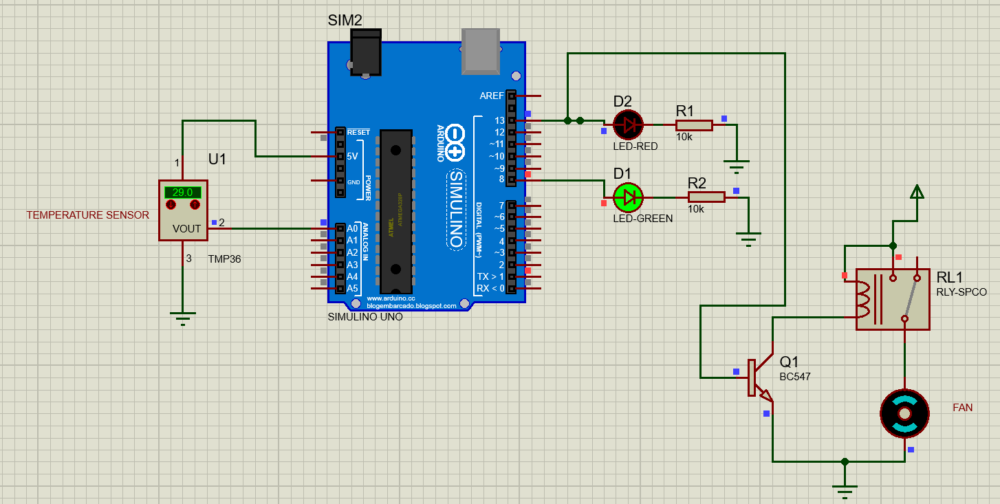
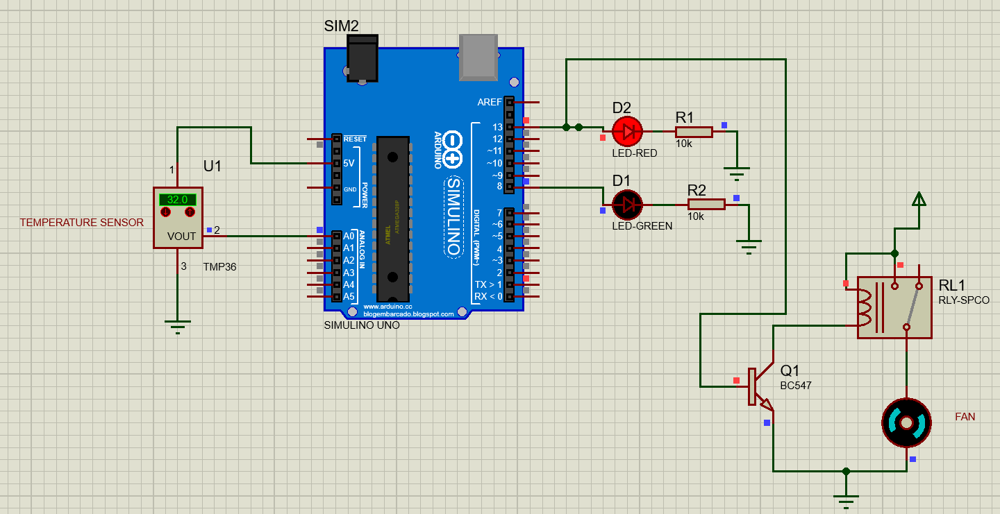

# Temperature-Monitor-Automated-Cooling-System-
A closed-loop smart temperature monitoring system simulated in Proteus. Features precision ADC conversion via an ATMega328P to trigger a relay-controlled DC cooling fan when temperatures exceed 30°C.

##  Hardware & Components
The simulation utilizes the following major components:
* **Microcontroller:** Arduino UNO (ATMega328P)
* **Temperature Sensor:** TMP36
* **Actuator Control:** BC547 Transistor and a Single Pole Close-Open Relay
* **Actuator:** DC Fan
* **Indicators:** Red and Green LEDs with associated Resistors

##  System Logic
The MCU reads data from the TMP36 Temperature Sensor to control the output devices based on the following temperature thresholds:
* **Normal State (< 30°C):** The Green LED stays ON.
* **Triggered State (> 30°C):** The Red LED and Cooling Fan turn ON.

##  Technical Highlights: Precision ADC Conversion
Instead of using standard abstraction libraries, this project handles the analog-to-digital (ADC) conversion manually for higher precision. 
* The internal 1.1V reference voltage is utilized and calibrated to 1.09V in the setup.
* The raw analog reading from pin A0 is converted to voltage using the formula: `volts = reading * aref_voltage / 1023.0`.
* The voltage is scaled to millivolts (`1000 * volts`) and converted to precise degrees Celsius using the formula: `(millivolts - 500) / 10`.

##  Simulation States

### 1. Normal Operation

### 2. Triggered Operation (Cooling Active)

##  How to Use
1. Clone this repository.
2. Open the Proteus simulation file to view the circuit.
3. Load the compiled Arduino `.hex` file into the simulated ATMega328P.
4. Adjust the temperature on the simulated TMP36 sensor to observe the system's automated response.

---
